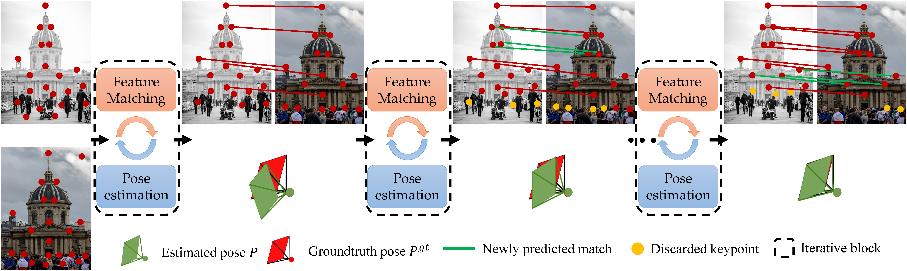

# Efficient Large-scale Localization by Global Instance Recognition

<p align="center">
  
</p>

In this work, we propose to leverage global instances, which are robust to illumination and season changes for both
coarse and fine localization. For coarse localization, instead of performing global reference search directly, we search
for reference images from recognized global instances progressively. The recognized instances are further utilized for
instance-wise feature detection and matching to enhance the localization accuracy.

* Full paper PDF: [Efficient Large-scale Localization by Global Instance Recognition](https://arxiv.org/abs/1911.11763).

* Authors: *Fei Xue, Ignas Budvytis, Daniel Olmeda Reino, Roberto Cipolla*

* Website: [lbr](https://github.com/feixue94/feixue94.github.io/lbr) for videos, slides, recent updates, and datasets.

## Dependencies

* Python 3 >= 3.6
* PyTorch >= 1.8
* OpenCV >= 3.4
* NumPy >= 1.18
* segmentation-models-pytorch = 0.1.3
* colmap
* pycolmap = 0.0.1

## Data preparation

Please follow instructions on the [VisualLocalization Benchmark](https://www.visuallocalization.net/datasets/) to
download images and reference 3D models of Aachen_v1.1 and RobotCar-Seasons datasets

* [Images of Aachen_v1.1 dataset](https://data.ciirc.cvut.cz/public/projects/2020VisualLocalization/Aachen-Day-Night/)
* [Images of RobotCar-Seasons dataset](https://data.ciirc.cvut.cz/public/projects/2020VisualLocalization/RobotCar-Seasons/)

You can download global instance labels used in this work here:

* [Global instances of Aachen_v1.1](https://drive.google.com/file/d/17qerRcU8Iemjwz7tUtlX9syfN-WVSs4K/view?usp=sharing)
* [Global instances of RobotCar-Seasons](https://drive.google.com/file/d/1Ns5I3YGoMCBURzWKZTxqsugeG4jUcj4a/view?usp=sharing)

Since only daytime images are included in Aachen_v1.1 and RobotCar-Seasons database, which may cause huge recognition
errors for the recognition of nighttime query images, we augment the training data by generating some stylized images,
which can also be downloaded along with global instances. The structure of files in Aachen_v1.1 dataset should be like
this:

```
- aachen_v1.1
    - global_seg_instance
       - db
       - query
       - sequences
    - images
    - 3D-models
      - images.bin
      - points3D.bin
      - cameras.bin
    - stylized
      - images (raw database images)
      - images_aug1
      - images_aug2
```

For RobotCar-Seasons dataset, it should be like this:

```
- RobotCar-Seasons
  - gloabl_seg_instance
    - overcast-reference
        - rear
  - images
    - overcast-reference
    - night
    ...
    - night-rain
  - 3D-models 
    - sfm-sift
        - cameras.bin
        - images.bin
        - points3D.bin
  - stylized
    - overcast-reference (raw database images)
    - overcast-reference_aug_d 
    - overcast-reference_aug_r 
    - overcast-reference_aug_nr 
```

## Pretrained weights

We provide pretrained weights for local feature detection and extraction, global instance recognition for Aachen_v1.1
and RobotCar-Seasons datasets, respectively, which can be downloaded
from [here](https://drive.google.com/file/d/1N4j7PkZoy2CkWhS7u6dFzMIoai3ShG9p/view?usp=sharing)

## Testing of global instance recognition

you will get predicted masks of global instances, confidence maps, global features, and visualization images.

* testing recognition on Aachen_v1.1

```
./test_aachen
```

<p align="center">
  
</p>

* testing recognition on RobotCar-Seasons

```
./test_robotcar
```

<p align="center">
  
</p>

## 3D Reconstruction

For fine localization, you also need a 3D map of the environment reconstructed by structure-from-motion.

* feature extraction and 3D reconstruction for Aachen_v1.1

```
./run_reconstruct_aachen
```

* feature extraction and 3d reconstruction for RobotCar-Seasons

```
./run_reconstruct_robotcar
```

## Localization with global instances

Once you have the global instance masks of the query and database images and the 3D map of the scene, you can run the
following commands for localization.

* localization on Aachen_v1.1

```
./run_loc_aachn
```

you will get results like this:

|          | Day  | Night       | 
| -------- | ------- | -------- |
| cvpr | 89.1 / 96.1 / 99.3 | 77.0 / 90.1 / 99.5  |
| post-cvpr | 88.8 / 95.8 / 99.2 | 75.4 / 91.6 / 100 |

* localization on RobotCar-Seasons

```
./run_loc_robotcar
```

you will get results like this:

|        | Night  | Night-rain       | 
| -------- | ----- | ------- |
| cvpr | 24.9 / 62.3 / 86.1 | 47.5 / 73.4 / 90.0  |
| post-cvpr | 28.1 / 66.9 / 91.8 | 46.1 / 73.6 / 92.5 |

## Training

If you want to retrain the recognition network, you can run the following commands.

* training recognition on Aachen_v1.1

```
./train_aachen
```

* training recognition on RobotCar-Seasons

```
./train_robotcar
```

## BibTeX Citation

If you use any ideas from the paper or code from this repo, please consider citing:

```
@inproceedings{xue2022imp,
  author    = {Fei Xue and Ignas Budvytis and Roberto Cipolla},
  title     = {Efficient Large-scale Localization by Global Instance Recognition},
  booktitle = {CVPR},
  year      = {2023}
}
```

## Acknowledgements

Part of the code is from previous excellent works
including [SuperPoint](https://github.com/magicleap/SuperPointPretrainedNetwork), [R2D2](https://github.com/naver/r2d2)
, [HLoc](https://github.com/cvg/Hierarchical-Localization). You can find more details from their released repositories
if you are interested in their works. 